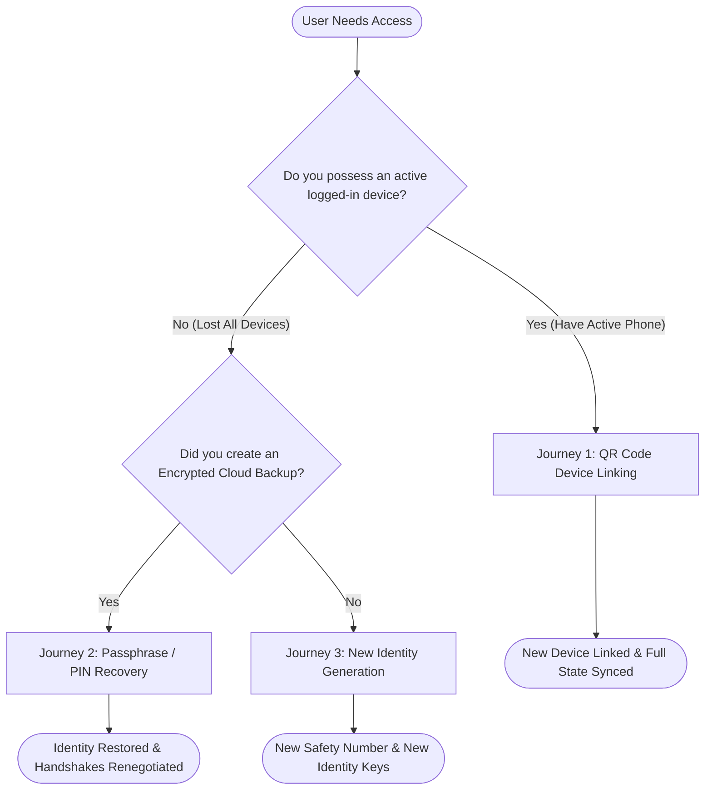

# GenChat Account Recovery & Multi-Device Cryptographic Journey

**Document Version**: 1.0.0  
**Target Audience**: Product Engineers, Security Architects, and End Users  
**Status**: Production Architecture Baseline  

---

## 1. Overview & Architectural Principles

In a true Post-Quantum End-to-End Encrypted (E2EE) messaging system, the server possesses **zero knowledge** of user private keys, session secrets, or plaintext history. Consequently, account recovery and multi-device synchronization require careful protocol design to balance **user convenience** with **uncompromising cryptographic security**.

GenChat guarantees three core cryptographic recovery principles:
1. **Zero-Knowledge Cloud Isolation**: Cloud key backups are encrypted client-side using PBKDF2-SHA256 (600,000 rounds) + AES-256-GCM. The server never learns the user's master passphrase or private keys.
2. **Forward Secrecy Invariance**: Ephemeral message ratchet keys are never uploaded to cloud backups. If a device is lost, past messages cannot be retroactively decrypted even if the backup PIN is compromised.
3. **Identity Fingerprint Stability**: Restoring from backup recovers the root Ed25519 identity key and ML-KEM identity seed, preventing false-positive "Safety Number Changed" security warnings for the user's contacts.

---

## 2. The Three User Recovery & Pairing Journeys



---

### Journey 1: Linking a New Device via QR Pairing (Active Device Available)

**Scenario**: Alice already has GenChat running on her mobile phone and wants to log in on her new laptop.

```
+------------------------+                              +------------------------+
|    Secondary Device    |                              |     Primary Device     |
|      (New Laptop)      |                              |     (Active Phone)     |
+------------------------+                              +------------------------+
            |                                                        |
            | 1. Generates ephemeral NIST P-256 ECDH pair            |
            | 2. Displays QR Code with SessionID & PubkeyHex         |
            |------------------------------------------------------->|
            |                                                        | 3. Scans QR Code
            |                                                        | 4. Displays 6-digit SAS Code
            |                                                        | 5. Verifies SAS code matches
            |                                                        | 6. Derives shared key via ECDH
            |                                                        | 7. Re-encrypts MLS group state
            |                                                        |    & identity keys with shared key
            |                                                        | 8. Uploads bundle (POST /approve)
            |<-------------------------------------------------------|
            | 9. Downloads bundle (POST /complete with SAS code)     |
            | 10. Decrypts with shared key & loads identity          |
            | 11. Session atomically marked CONSUMED                 |
            v                                                        v
     [Device Linked]                                          [Device Confirmed]
```

#### Cryptographic Continuity:
- **Identity Keys**: The laptop receives Alice's existing Ed25519 identity key and ML-KEM seed.
- **1:1 PQXDH Sessions**: Laptop generates its own device prekeys, enabling multi-device message fanout.
- **MLS Group Chats**: The primary device re-encrypts the active TreeKEM group state directly to the laptop. Alice can immediately read and participate in existing group chats without requesting group re-invites.

---

### Journey 2: Total Device Loss Restored via Cloud Backup + PIN

**Scenario**: Bob lost his phone in a taxi and has no other active devices. Bob gets a replacement phone, logs in with his passkey/phone credentials, and initiates recovery.

```
Step 1: Bob enters his Master Backup Passphrase / PIN into the GenChat Client.
Step 2: Client fetches encrypted blob from GET /auth/backup (Rate-limited: 5 attempts / 15 min).
Step 3: Client executes PBKDF2-SHA256 (600,000 iterations) with salt to derive AES-256-GCM key.
Step 4: Client decrypts the identity bundle locally in browser/device memory.
Step 5: Client uploads fresh PQXDH prekeys and registers the new device ID with Auth Service.
Step 6: Bob's identity is fully restored!
```

#### Crucial Cryptographic FAQ for Journey 2:
> **Question**: If Bob loses all devices and restores via backup PIN, does he need to re-establish PQXDH sessions with every contact? What do his contacts see?

1. **Safety Numbers Do NOT Change**:
   Because Bob's root Ed25519 identity key was preserved in the backup, Bob's public key fingerprint remains identical:
   $$\text{Fingerprint} = \text{Truncate}(\text{SHA-256}(K_{\text{Ed25519}}))$$
   Bob's contacts will **not** receive a jarring "Safety Number Changed" security banner. Mutual cryptographic trust is maintained seamlessly.
2. **PQXDH Handshake Renegotiation**:
   The ephemeral symmetric ratchet chains from Bob's lost phone are gone (preserving Forward Secrecy for Bob's past messages).
   When Bob sends a message to Alice, Bob's client automatically attaches a fresh Post-Quantum `initMessage` (encapsulating an ML-KEM-768 ciphertext). Alice's client receives this envelope, transparently initializes a new PQXDH ratchet session, and replies. Zero manual interaction is required from either user.
3. **MLS Group Chats**:
   The server detects Bob's new device. The group's admin or active members automatically issue an MLS `Update` or `Add` proposal incorporating Bob's new key package into the TreeKEM ratchet tree, restoring group continuity.
4. **Historical Plaintexts**:
   Past messages stored solely on the lost device cannot be recovered from the cloud (since GenChat never stores message keys in the cloud). This guarantees that anyone obtaining Bob's backup PIN in the future cannot read past historical conversations.

---

### Journey 3: Stolen Device Revocation

**Scenario**: Alice loses her tablet and wants to ensure it can no longer receive or decrypt her messages.

```
1. Alice opens Settings > Linked Devices on her primary phone.
2. Alice selects "Lost Tablet" and clicks "Revoke Device".
3. Auth service terminates the tablet's session and deletes its push tokens and prekeys.
4. For every MLS group Alice belongs to, Alice's phone generates an MLS Commit removing the tablet's leaf node from the TreeKEM tree.
5. Post-Compromise Security (PCS): The tablet is mathematically incapable of decrypting any subsequent messages.
```

---

## 3. UI/UX Wireframe & Guidance Specifications

### Backup Setup Screen:
```
+-----------------------------------------------------------+
|               Create Encrypted Key Backup                 |
+-----------------------------------------------------------+
| Protect your account against device loss.                 |
| Your keys are encrypted with zero-knowledge cryptography. |
|                                                           |
| Master Passphrase / PIN:                                  |
| [ ****************** ]                                    |
| Strength: [=======---] Strong                             |
| (Tip: Use at least 8 characters with letters & numbers)   |
|                                                           |
| Confirm Passphrase:                                       |
| [ ****************** ]                                    |
|                                                           |
|  [ Cancel ]                        [ Save Encrypted Backup ]|
+-----------------------------------------------------------+
```

### Recovery Screen:
```
+-----------------------------------------------------------+
|                   Restore Key Backup                      |
+-----------------------------------------------------------+
| Enter the master passphrase you created for this account. |
|                                                           |
| Enter Master Passphrase:                                  |
| [ ****************** ]                                    |
|                                                           |
| Remaining attempts: 5 of 5                                |
|                                                           |
|  [ Cancel ]                             [ Decrypt & Verify ]|
+-----------------------------------------------------------+
```
